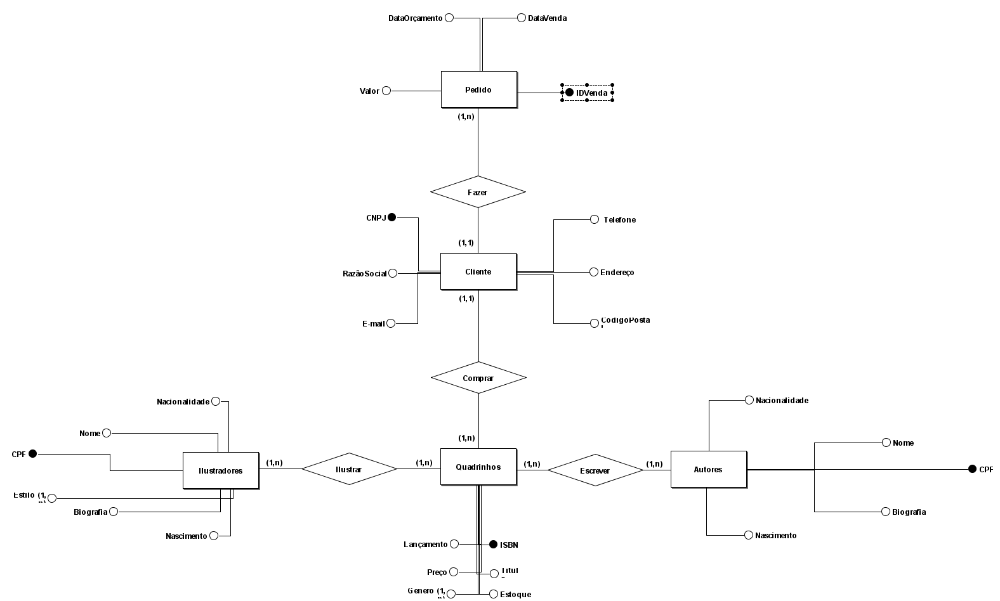
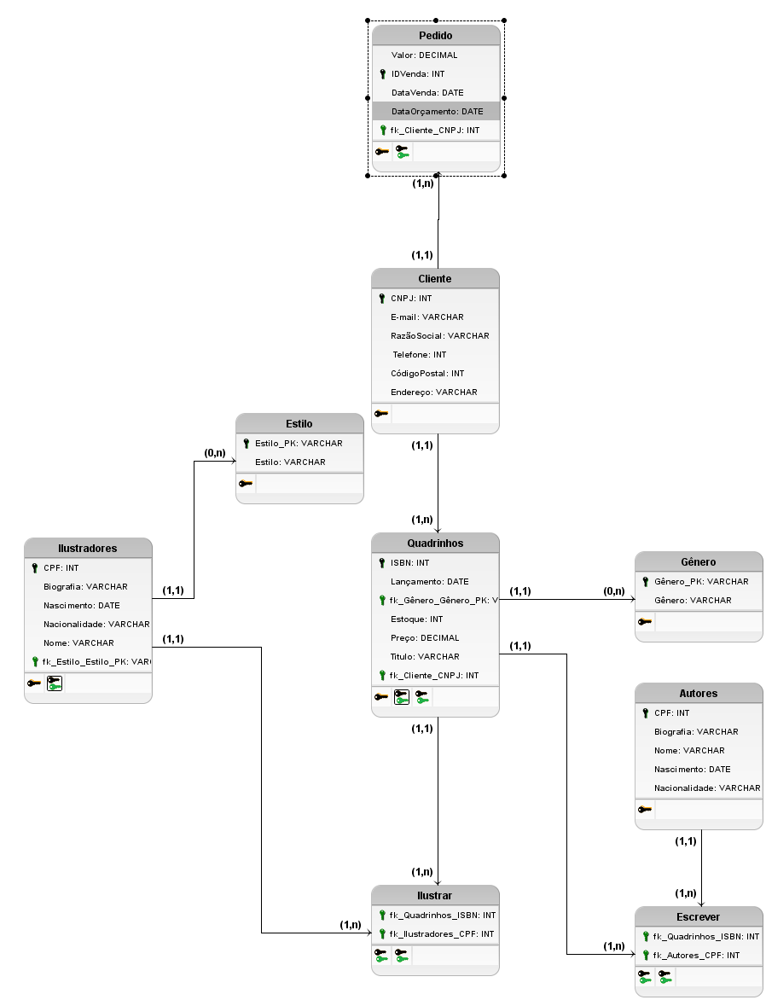

<div align="center">
  <h1>✏️Cenário✏️</h1>
  "Bom dia, boa tarde e boa noite a todos. Foi percebido a necessidade de um sistema de banco de dados na Owl Comics Inc. devido a falta de controle que a empresa está tendo ao tentar controlar os diversos processos internos. Vamos começar definindo cada quadro que temos necessidade, primeiro iremos cadastrar o principal: as HQs. Elas deverão ter um identificador chamado ISBN(um tipo de identificação com 13 digitos), deverão ter o título, gênero, data de lançamento, preço, quantidade dele em estoque, quem é o autor da historia e o ilustrador responsavel. 
  Para o autor queremos poder cadastrar seu CPF, nome, sobrenome, uma biografia para ser aplicada automaticamente nos livros, data de nascimento,nacionalidade, quais projetos ele está e(ou) foi responsavel e prazo para entrega dos trabalhos.
  Para o ilustrador queremos cadastrar seu CPF, nome, sobrenome, uma pequena biografia, data de nascimento,nacionalidade, estilo artistico(as opções são manga, cartoon, realista, etc.), prazo para entrega dos trabalhos e quais projetos ele está e(ou) foi responsavel.
  Vendemos em lote para algumas livrarias e bibliotecas, queremos manter um cadastro de clientes também. Queremos o CNPJ do lugar, a razão social, e-mail, número de telefone, endereço, cidade que esta localizado, código postal e país.
  E por ultimo, quando esses clientes fizerem algum pedido deverá ser registrado no sistema. Cada venda devera ter um número de identificação, a data que foi feito o orçamento, a data da venda, o CNPJ e nome do cliente e por fim o total da compra."
  <h1>📃Modelo Conceitual📃</h1>
  
  <h1>⚙️Modelo Lógico⚙️</h1>
  
  <h1>💻Modelagem Física:💻</h1>
  <h2>Criação do banco de dados:</h2>
  ```sqlCREATE DATABASE OwlComics;
  USE OwlComics;```
  <h2>Criação da tabela:</h2>
  
  <h2>Criação da tabela:</h2>
  
  <h2>Criação da tabela:</h2>
  
  <h2>Criação da tabela:</h2>
  
  <h2>Criação da tabela:</h2>
  
</div>
